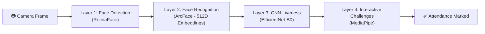
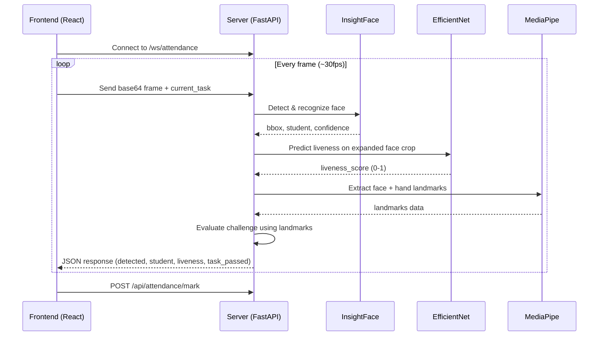
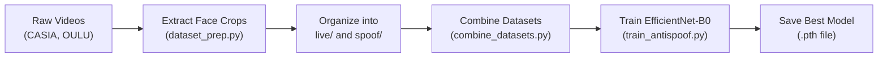

# 🛡️ HoloSecure — Complete Architecture Guide

> **Goal**: After reading this, you should be able to explain every part of this project to anyone — a professor, an interviewer, or a teammate.

---

## What Does HoloSecure Do?

HoloSecure is an **AI-powered attendance system** that prevents cheating (spoofing). 

**The Problem**: Normal attendance systems use simple face recognition — but someone can hold up a **photo of your face** on their phone and mark your attendance. That's called a **presentation attack** or **spoofing**.

**Our Solution**: HoloSecure uses **4 layers of verification**:



A printed photo or phone screen might fool Layer 1 and 2, but it **cannot** blink, smile, or raise a hand — so Layers 3 and 4 catch it.

---

## Project Structure

```
HoloSecure/
├── main.py                          # 🚀 Entry point — starts the server
├── requirements.txt                 # 📦 Python dependencies
├── configs/config.yaml              # ⚙️ Configuration (thresholds, paths)
│
├── src/
│   ├── api/
│   │   └── server.py                # 🌐 FastAPI backend (REST + WebSocket)
│   ├── vision/
│   │   ├── insightface_wrapper.py   # 👁️ Face detection + recognition
│   │   ├── liveness.py              # 🧠 CNN anti-spoof model
│   │   └── mediapipe_tracker.py     # 🖐️ Hand + face landmark tracking
│   ├── engine/
│   │   ├── challenge_generator.py   # 🎲 Random challenge picker
│   │   └── challenge_evaluator.py   # ✅ Challenge pass/fail logic
│   ├── database/
│   │   └── db_manager.py            # 💾 SQLite database (SQLAlchemy)
│   └── utils/
│       ├── config_loader.py         # 📖 YAML config reader
│       └── logger.py                # 📝 Logging utility
│
├── frontend/                        # ⚛️ React + Vite frontend
├── models/                          # 🏋️ Pre-trained model weights
├── train/                           # 🔬 Training scripts
└── database/                        # 🗄️ SQLite DB file
```

---

## The 4 Layers — Explained in Detail

### Layer 1: Face Detection (RetinaFace)

📄 **File**: [`insightface_wrapper.py`](file:///Users/kritishpoptani/VT_PROJECT/src/vision/insightface_wrapper.py)

**What it does**: Finds faces in a camera frame and draws a bounding box around them.

**How it works**:
- Uses InsightFace's `buffalo_l` model which includes **RetinaFace** (a deep learning face detector)
- Filters out faces smaller than 100×100 pixels (to avoid false detections from background noise)
- Returns face objects containing the bounding box coordinates and a 512-dimensional face embedding

**Key code** ([lines 18-37](file:///Users/kritishpoptani/VT_PROJECT/src/vision/insightface_wrapper.py#L18-L37)):
```python
def analyze_frame(self, frame):
    faces = self.app.get(frame)          # InsightFace detects all faces
    valid_faces = []
    for face in faces:
        w = bbox[2] - bbox[0]            # Width of face
        h = bbox[3] - bbox[1]            # Height of face
        if w >= 100 and h >= 100:        # Reject tiny faces
            valid_faces.append(face)
    return valid_faces
```

**Interview Q**: *"Why filter by minimum face size?"*  
**Answer**: Small faces (far away or noise) produce unreliable embeddings. We need at least 100×100 pixels for ArcFace to generate a good 512-d vector.

---

### Layer 2: Face Recognition (ArcFace + Cosine Similarity)

📄 **File**: [`insightface_wrapper.py`](file:///Users/kritishpoptani/VT_PROJECT/src/vision/insightface_wrapper.py#L39-L62)

**What it does**: Identifies WHO the face belongs to by comparing it against registered students.

**How it works**:
1. ArcFace converts each face into a **512-dimensional embedding** (a vector of 512 numbers)
2. To compare two faces, we compute **cosine similarity** between their vectors:

```
similarity = dot(A, B) / (|A| × |B|)
```

- If similarity > 0.45 → it's a match ✅
- If similarity < 0.45 → unknown person ❌

3. During **registration**, we capture multiple photos, extract embeddings, and store their **average** in SQLite

**Key code** ([lines 39-44](file:///Users/kritishpoptani/VT_PROJECT/src/vision/insightface_wrapper.py#L39-L44)):
```python
def compare_embeddings(self, emb1, emb2):
    sim = np.dot(emb1, emb2) / (np.linalg.norm(emb1) * np.linalg.norm(emb2))
    return float(sim)
```

**Interview Q**: *"Why cosine similarity and not Euclidean distance?"*  
**Answer**: Cosine similarity measures the **angle** between vectors, not magnitude. Two images of the same person taken in different lighting will have similar direction but different magnitudes. Cosine handles this better.

---

### Layer 3: CNN Liveness Detection (EfficientNet-B0)

📄 **File**: [`liveness.py`](file:///Users/kritishpoptani/VT_PROJECT/src/vision/liveness.py)

**What it does**: Looks at the face crop and predicts whether it's a **real face** or a **photo/screen** (spoof).

**How it works**:
1. We use **EfficientNet-B0** — a lightweight CNN from Google that's very accurate for its size
2. The model is **pre-trained on ImageNet** (millions of general images), then **fine-tuned** on our anti-spoofing dataset (real faces vs. printed photos vs. phone screens)
3. The final layer is modified from 1000 classes (ImageNet) → **1 output** (binary: live or spoof)
4. Output goes through **sigmoid** to get a score between 0 and 1:
   - Score > 0.7 → Live person ✅
   - Score < 0.7 → Likely a spoof ❌

**Key architecture** ([lines 12-22](file:///Users/kritishpoptani/VT_PROJECT/src/vision/liveness.py#L12-L22)):
```python
class AntiSpoofModel(nn.Module):
    def __init__(self):
        super().__init__()
        self.model = models.efficientnet_b0(weights=weights)
        num_ftrs = self.model.classifier[1].in_features  # 1280
        self.model.classifier[1] = nn.Linear(num_ftrs, 1)  # Binary output
```

**Smart trick in the code** ([lines 146-151](file:///Users/kritishpoptani/VT_PROJECT/src/api/server.py#L146-L151)):
```python
# Expand bbox by 40% to include phone bezels/edges
pad_w, pad_h = int(w * 0.4), int(h * 0.4)
```
> We expand the face crop by 40% so the model can also see **phone bezels**, **screen reflections**, and **paper edges** — these are strong spoof signals!

**Interview Q**: *"Why EfficientNet-B0 and not a bigger model?"*  
**Answer**: B0 is only 5.3M parameters and runs at 30+ FPS on CPU. We need real-time inference since we're processing webcam frames live. A bigger model (B4, B7) would be more accurate but too slow for real-time.

**Interview Q**: *"Why expand the bounding box by 40%?"*  
**Answer**: If you crop just the face, a photo on a phone and a real face look very similar. But when you include surrounding context, the model can spot phone bezels, screen glare, flat lighting, and paper edges — which are strong indicators of spoofing.

---

### Layer 4: Interactive Challenges (MediaPipe)

📄 **Files**: 
- [`mediapipe_tracker.py`](file:///Users/kritishpoptani/VT_PROJECT/src/vision/mediapipe_tracker.py) — Detects face and hand landmarks
- [`challenge_generator.py`](file:///Users/kritishpoptani/VT_PROJECT/src/engine/challenge_generator.py) — Picks 3 random challenges
- [`challenge_evaluator.py`](file:///Users/kritishpoptani/VT_PROJECT/src/engine/challenge_evaluator.py) — Evaluates if the user passed

**What it does**: Asks the user to perform 3 random actions (blink, smile, raise palm, etc.) to prove they're physically present.

**Why this is the strongest layer**: A printed photo CANNOT blink. A video on a phone CANNOT raise a hand on command. This is the **hardest layer to spoof**.

#### Challenge Categories:

| Category | Challenges | How It's Detected |
|----------|-----------|-------------------|
| 👁️ Eyes | `blink_once`, `blink_twice` | Eye Aspect Ratio (EAR) drops below threshold |
| 🔄 Head | `look_left`, `look_right`, `look_up`, `look_down` | Nose position relative to eyes/ears changes |
| 🖐️ Hands | `raise_open_palm`, `thumbs_up` | Hand landmark distances from wrist |
| 😊 Face | `smile`, `neutral_face` | Mouth width ÷ eye distance ratio |

#### How Blink Detection Works ([lines 67-98](file:///Users/kritishpoptani/VT_PROJECT/src/engine/challenge_evaluator.py#L67-L98)):

```
Eye Aspect Ratio (EAR) = (v1 + v2) / (2 × h)

     p2    p3
      \  /
  p1 ------- p4     ← h = horizontal distance
      /  \
     p6    p5
      ↑↑
    v1, v2 = vertical distances
```

- Eyes open → EAR ≈ 0.25-0.30
- Eyes closed → EAR ≈ 0.05-0.10
- We use an **EMA (Exponential Moving Average)** to track each person's natural resting EAR, then detect a **15% drop** as a blink
- A "blink" is counted only on the **closed→open transition** (not while holding eyes shut)

#### How Smile Detection Works ([lines 157-169](file:///Users/kritishpoptani/VT_PROJECT/src/engine/challenge_evaluator.py#L157-L169)):

```python
ratio = mouth_width / eye_distance
if ratio > 0.55:  # Smiling
```

We normalize mouth width by the distance between the eyes (so it works regardless of how far you are from the camera).

#### Smart Anti-Cheat Design:
- Challenges are picked from **different categories** to ensure variety ([challenge_generator.py](file:///Users/kritishpoptani/VT_PROJECT/src/engine/challenge_generator.py#L22-L28))
- `prev_head_state` is **NOT reset** between tasks — prevents auto-bypassing by holding a turned head
- Both Layer 3 (CNN) AND Layer 4 (challenge) must pass: `task_passed = passed AND is_live`

---

## The Server — How Everything Connects

📄 **File**: [`server.py`](file:///Users/kritishpoptani/VT_PROJECT/src/api/server.py)

The server uses **FastAPI** with both REST endpoints and a **WebSocket** for real-time video:

### API Endpoints:

| Endpoint | Method | Purpose |
|----------|--------|---------|
| `/api/register` | POST | Register a new student (sends multiple face photos) |
| `/api/tasks` | GET | Get 3 random challenges |
| `/ws/attendance` | WebSocket | Real-time video stream for verification |
| `/api/attendance/mark` | POST | Mark attendance after passing all checks |
| `/api/attendance/export` | GET | Download attendance as CSV |
| `/api/stats` | GET | Get enrolled count + today's verifications |

### The WebSocket Flow (the heart of the system):



For each frame, the server runs all 4 layers and sends back a JSON response. The frontend uses this to show real-time feedback.

---

## The Database

📄 **File**: [`db_manager.py`](file:///Users/kritishpoptani/VT_PROJECT/src/database/db_manager.py)

Uses **SQLAlchemy ORM** with **SQLite**. Two tables:

### `users` table:
| Column | Type | Purpose |
|--------|------|---------|
| id | Integer (PK) | Auto-increment ID |
| roll_number | String (unique) | Student roll number |
| name | String | Student name |
| department | String | e.g., "CSE" |
| semester | String | e.g., "6th" |
| section | String | e.g., "A" |
| embedding | LargeBinary | 512 × float32 = 2048 bytes |
| registration_date | DateTime | When registered |

### `attendance` table:
| Column | Type | Purpose |
|--------|------|---------|
| id | Integer (PK) | Auto-increment ID |
| roll_number | String | Links to users |
| date | String | "YYYY-MM-DD" |
| time | String | "HH:MM:SS" |
| status | String | "Present" |

**Key feature**: Duplicate prevention — a student can only be marked present **once per day** ([lines 89-97](file:///Users/kritishpoptani/VT_PROJECT/src/database/db_manager.py#L89-L97)).

**Embedding storage trick**: The 512-d float32 numpy array is stored as raw bytes (`embedding.tobytes()`) and reconstructed with `np.frombuffer(bytes, dtype=np.float32)`.

---

## The Training Pipeline

📄 **File**: [`train_antispoof.py`](file:///Users/kritishpoptani/VT_PROJECT/train/train_antispoof.py)

How the EfficientNet-B0 anti-spoof model was trained:

1. **Datasets used**: CASIA-FASD, OULU-NPU, RealVSFake — containing real face photos and spoof attempts (printed photos, phone replays)
2. **Data augmentation**: Random flips, rotations (±10°), color jitter — to make the model robust
3. **Loss function**: `BCEWithLogitsLoss` — Binary Cross Entropy for live/spoof classification
4. **Optimizer**: Adam (lr=0.001)
5. **Best model selection**: Saves the model with the highest validation accuracy



---

## Tech Stack Summary

| Component | Technology | Why? |
|-----------|-----------|------|
| Backend | **FastAPI** + Uvicorn | Async, WebSocket support, fast |
| Frontend | **React** + Vite + Tailwind | Modern, fast dev server |
| Face Detection | **RetinaFace** (via InsightFace) | State-of-the-art accuracy |
| Face Recognition | **ArcFace** (via InsightFace) | Best embedding quality |
| Liveness CNN | **EfficientNet-B0** (PyTorch) | Fast + accurate for binary classification |
| Landmark Tracking | **MediaPipe** (Face + Hands) | Real-time, works on CPU |
| Database | **SQLite** + SQLAlchemy | Lightweight, zero setup |
| Communication | **WebSocket** | Real-time bidirectional video streaming |

---

## Key Interview Questions & Answers

**Q: What makes this better than a regular face recognition system?**
> Regular systems only verify identity (who you are). HoloSecure also verifies **presence** (that you're physically there) through CNN liveness + interactive challenges. A photo can fool face recognition but can't blink on command.

**Q: Can someone fool this with a video of the person?**
> Partially — a video can pass the CNN liveness check sometimes, but it **cannot** respond to random challenges. The challenges are randomly selected from different categories each time, so pre-recording a video of all possible challenge combinations is impractical.

**Q: Why use both CNN liveness AND interactive challenges?**
> Defense in depth. The CNN catches obvious spoofs (printed photos, phone screens) instantly. The challenges catch sophisticated attacks (high-quality video replays). Both must pass: `task_passed = passed AND is_live`.

**Q: Why WebSocket instead of regular HTTP?**
> We need to process 30 frames per second in real-time. HTTP would require a new connection per frame (huge overhead). WebSocket keeps a single persistent connection open for continuous bidirectional data flow.

**Q: How do you store face embeddings?**
> As raw bytes in SQLite. A 512-d float32 vector = 2048 bytes. We serialize with `numpy.tobytes()` and deserialize with `numpy.frombuffer()`. This is more compact than storing as JSON/CSV.

---

> [!TIP]
> **Next steps**: Open [`server.py`](file:///Users/kritishpoptani/VT_PROJECT/src/api/server.py) and [`challenge_evaluator.py`](file:///Users/kritishpoptani/VT_PROJECT/src/engine/challenge_evaluator.py) side by side. Trace what happens when a single frame arrives over WebSocket — that's the core loop of the entire system.
